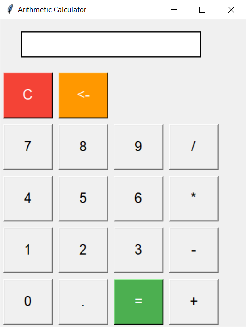

# Arithmetic Calculator using Tkinter

## Overview

Welcome to the **Arithmetic Calculator using Tkinter** repository! This project is a simple yet powerful arithmetic calculator built using Python's Tkinter library. It features a user-friendly interface, allowing users to perform basic arithmetic operations with ease. Whether you're a beginner looking to understand GUI development in Python or a seasoned developer wanting a quick calculation tool, this project is perfect for you.

## Features

- **User-friendly Interface**: Easy to use with clear buttons and display.
- **Basic Arithmetic Operations**: Perform addition, subtraction, multiplication, and division.
- **Additional Functionalities**:
  - Clear (C) button to reset the display.
  - Backspace (<-) button to delete the last entered character.
  - Error handling to manage invalid inputs gracefully.
- **Responsive Design**: Adjusts to different window sizes for better usability.

## User Interface


## Getting Started

### Prerequisites

Ensure you have Python installed on your system. You can download it from [Python's official website](https://www.python.org/downloads/).

### Installation

Clone this repository to your local machine using:
```bash
git clone https://github.com/yourusername/arithmetic-calculator-tkinter.git
```

### Navigate to the project directory:

```bash
cd arithmetic-calculator-tkinter 
```

### Environment Setup:
Create Virtual Environment
```bash
python -m venv venv 
```

Activate the virtual environment:
- On Windows
```bash
venv\Scripts\activate
```

- On macOS and Linux:
```bash
source venv/bin/activate
```

Install Tkinter 
```bash
pip install tkinter
```
### Run the application:
```bash
python main.py
```

## Usage
The calculator supports the following operations:

- Addition (+)
- Subtraction (-)
- Multiplication (*)
- Division (/)
- Decimal points (.)
- Clear (C) and Backspace (<-) functionalities
Simply click the buttons to input your calculations and press = to see the result.

#### Contributing
Contributions are welcome! If you have any suggestions, feature requests, or bug reports, please open an issue or submit a pull request. Ensure your code adheres to the existing style and includes relevant tests.

#### License
This project is licensed under the MIT License. See the LICENSE file for more details.

#### Acknowledgments
This project utilizes the Tkinter library for the graphical user interface.
Inspired by various online tutorials and personal projects to create a useful tool for everyday arithmetic calculations.

##### Keywords
Tkinter calculator
Python GUI application
Arithmetic operations in Python
Basic calculator with Tkinter
Python calculator source code
GUI programming with Tkinter
Simple arithmetic calculator Python
Python Tkinter project example
Feel free to explore, use, and contribute to the Arithmetic Calculator using Tkinter project!


